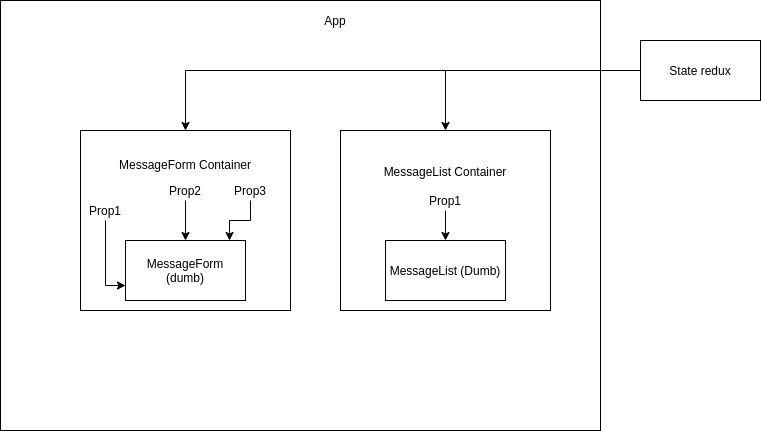

## Redux

Redux nous fourni un store. Ce store est composé de méthodes pour intergair avec un state.

store.getState() -> pour consulter le state
store.dispatch() -> pour modifier le state
store.suscribe() -> pour être tenu au courant des modifs du state

Action:
un objet js avec une propriété "type"
Action Creator:
une fonction qui fabrique un objet d'action
Reducer:
une fonction qui à partir d'un state et d'une action nous renvoie un nouveau state

## React-Redux

Une librairie qui permet de relier le store à nos composants, pour qu'ils puissent travailler avec le state.

### Provider

Un composant fourni par react-redux qui reçoit via les props notre store, et qui englobe toute notre application.

```javascript
  <Provider store={store}>
    <App />
  </Provider>,
);
```

Pour utiliser ce store dans nos composant, on a 2 écoles:

#### Les hooks

La librairie nous offre 2 hooks pour consulter le state, ou le modifier:

- useSelector https://react-redux.js.org/api/hooks#useselector-examples
- useDispatch https://react-redux.js.org/api/hooks#usedispatch

Le 'problème" des hooks, c'est qu'on met la logique de gestion de state dans nos composants directement, ils ne sont donc plus "dumb" (ou idiots) car ils ont besoin d'importer des choses pour fonctionner

#### connect

Connect est une fonction fournie par react-redux qui nous permet de séparer concrètement et effectivement la logique ayant à voir avec le state de nos composants.

connect sert à donner en tant que props:

- soit des infos qui viennent du state (comme useSelector)
- soit des functions qui dispatchent des actions (comme useDispatch)

On appelle un composant qui utilise des choses externes pour pouvoir fonctionner un smartComponent. Si ces choses externes ont à voir avec notre state redux, alors on l'appelle plutôt un "container"

#### Container

Un composant React, qui importe un dumbComponent et lui donner via les props des infos qui viennent du state ET / OU des fonctions qui dispatchent des actions



**mapStateToProps**

Une fonction utlisée par connect pour savoir:

- quels props rajouter au composant
- à quelles propriétés du state les relier

**mapDispatchToProps**

Une fonction utilisée par connect pour savoir:

- quels props rajouter au composant
- quelle action les relier

#### Exemples de containers

NbrColors

```javascript
import { connect } from 'react-redux';
// J'importe le composant à qui je veux donner de nouveaux props
import NbColors from '../components/NbColors';

// Je décris quelles propriétés du state je veux donner en props
const mapStateToProps = (state) => ({
  nombreColors: state.nbColors,
});
// Pas beoin
const mapDispatchToProps = null;

// J'exporte mon nouveau composant avec ses nouveaux props
export default connect(mapStateToProps, mapDispatchToProps)(NbColors);
```

Controls

```javascript
import { connect } from 'react-redux';
import Controls from '../components/Controls';
// J'importe la fonction pour générer des couleurs
import { randomHexColor } from '../utils';
// J'importe les actions creators dont j'ai besoin
import { randFirst, randLast } from '../store/actions';

// Pas besoin de relier ce composant au state
const mapStateToProps = null;

// Je veux donner 2 props dispatchant chacun
// une action différente
const mapDispatchToProps = (dispatch) => ({
  randFirst: () => {
    // Je dispatch l'action générée par randFirst
    const color = randomHexColor(); // Je fais une couleur
    const action = randFirst(color); // Je fais mon action
    dispatch(action); // je dispatch mon action
  },
  randLast: () => {
    // Mêê chose que randFirst, mais en une ligne
    dispatch(randLast(randomHexColor()));
  },
});

// J'exporte mon nouveau composant avec les props dont il a besoin
export default connect(mapStateToProps, mapDispatchToProps)(Controls);
```

########## IMPORTANT !!!! ##########

Utilisez bien votre container et non pas votre composant dans votre App

######################################################################
